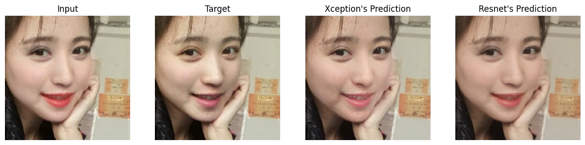
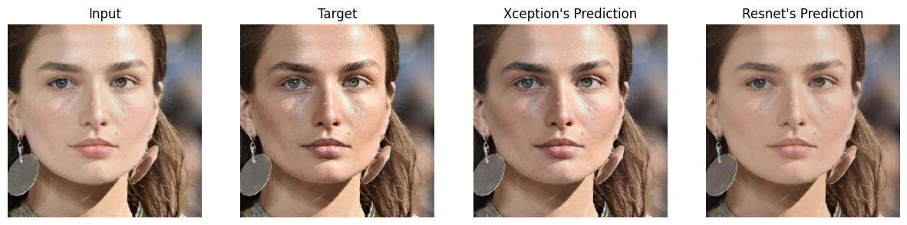
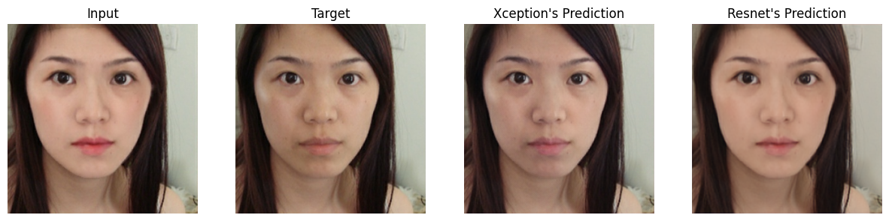

# **De-Makeup**


## Description
The project aims to transform the realm of beauty by developing a sophisticated UNet architecture model where the input represents a woman adorned with makeup, while the output showcases her natural, makeup-free beauty. Furthermore, elevate the project's impact and accessibility by deploying it seamlessly using [Flask](https://flask.palletsprojects.com/en/3.0.x/) for web interfacing, [TensorFlow Serving](https://www.tensorflow.org/tfx/serving/docker) for robust serving capabilities, and [OpenVINO Serving](https://docs.openvino.ai/2023.3/ovms_what_is_openvino_model_server.html) for optimized inference performance

## Evaluation Metic
As an Image Generation problem, we use Structural Similarity Index Measurement (SSIM) to evaluate model's performance. Due to lacking useage free GPU on [Colab](https://colab.research.google.com/), we only record the final epoch metric:
  * Resnet: 0.91625
  * Xception: 0.9351

<p align="center">
  <br/>
  <i>Test sample 1</i>
</p>

<p align="center">
  <br/>
  <i>Test sample 2</i>
</p>

<p align="center">
  <br/>
  <i>Test sample 3</i>
</p>

## Demo
<p align="center">
  <br/>
  <i>Project deployment.</i>
</p>

## Run Locally
Clone the project

```bash
  git clone https://github.com/TunggTungg/de_makeup.git
```

Go to the project directory

```bash
  cd de_makeup
```

To deploy this project with [TensorFlow Serving](https://www.tensorflow.org/tfx/serving/docker)

```bash
  cd tf_serving
  docker-compose up --build
```

To deploy this project with  [OpenVINO Serving](https://docs.openvino.ai/2023.3/ovms_what_is_openvino_model_server.html)

```bash
  cd openvino_serving
  docker-compose up --build
```
## Contributing

Pull requests are welcome. For major changes, please open an issue first
to discuss what you would like to change.

Please make sure to update tests as appropriate.

## License

[MIT](https://choosealicense.com/licenses/mit/)
